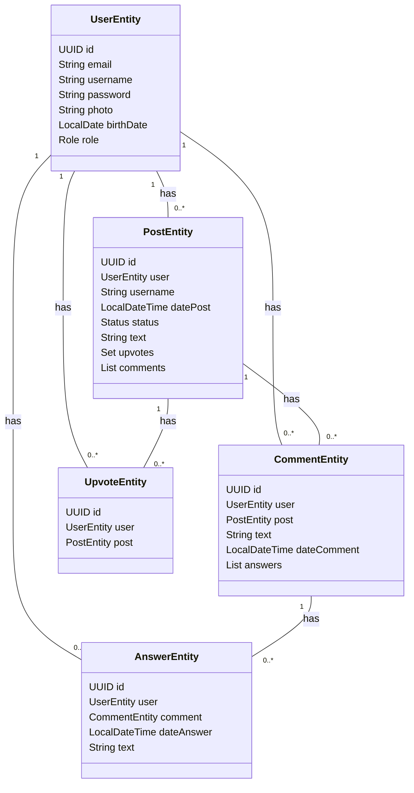

<h3 align="center">Posts</h3>

<br>

<div align="center">


###### *PostgreSQL, Java, Spring Boot, JWT, RabbitMQ, OpenAPI, Docker*

#

</div>

### Como realizar as requisições ⁉

#### ▶ Faça suas requisições *<a href="posts-i9sv.onrender.com/swagger-ui.html">aqui</a>* 

Para fazer as requisições é necessário estar conectado à uma conta cadastrada, caso não queria se cadastrar, há um conta de demonstração já criada para este propósito, acesse a parte ***users/login*** para mais informações.

<details open>
    
<summary>/users/register</summary>

<br>

> Por gentileza use um de seus emails, uma mensagem de boas-vindas será enviada

```java
"email": "email válido",
"username": ">= 4 letras e <= 33",
"password": ">= 4 letras e <= 33, ao menos 1 letra minúscula, 1 máiuscula e 1 um número.",
"photo": null,
"birthDate": "2001-01-01, >= 12 anos"
```

</details>

<details>
<summary>/users/login</summary>

<br>

> O usuário ***demo*** está permitido à apenas realizar requisições do tipo POST, recomendo se cadastrar e então se conectar
  
```java
"username":"demo",
"senha":"Senha123"
```

<div align="center">
  


</div>

> Copie o valor do Token JWT retornado

- Agora, na parte de cima da página, acesse o botão ***Authorize*** e cole o valor copiado para liberar todas as requisições!

<br>

<div align="center">


</div>

> Este token será utilizado para maioria das requisições no campo "Authorization"

</details>


## Diagrama de Classe do domínio da aplicação



## Arquitetura

<details>
    

    
</details>

###### Banco de Dados e Server Deploy por <a href="https://render.com">*Render*</a>

<div align="center">


  
</div>
