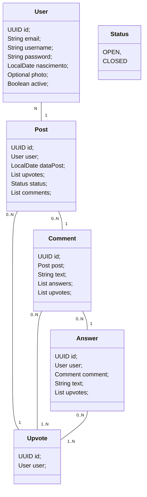

## Diagrama de Classe do Domain

```mermaid
classDiagram

    class User {
        UUID id;
        String email;
        String username;
        String password;
        LocalDate nascimento;
        Optional<String> photo;
        Boolean active;
    }

    class Post {
        UUID id;
        User user;
        LocalDate dataPost;
        List<Upvote> upvotes;
        Status status;
        List<Comment> comments;
    }

    class Status {
        OPEN,
        CLOSED
    }

    class Comment {
        UUID id;
        Post post;
	      String text;
        List<Answer> answers;
        List<Upvote> upvotes;
    }

    class Answer {
        UUID id;
        User user;
        Comment comment;
	      String text;
        List<Upvote> upvotes;
    }

    class Upvote {
        UUID id;
        User user;
    }

    User "N" -- "1" Post
    Post "0..N" -- "1" Comment
    Post "0..N" -- "1" Upvote
    Comment "0..N" -- "1" Answer
    Comment "0..N" -- "1..N" Upvote
    Answer "0..N" -- "1..N" Upvote
```
